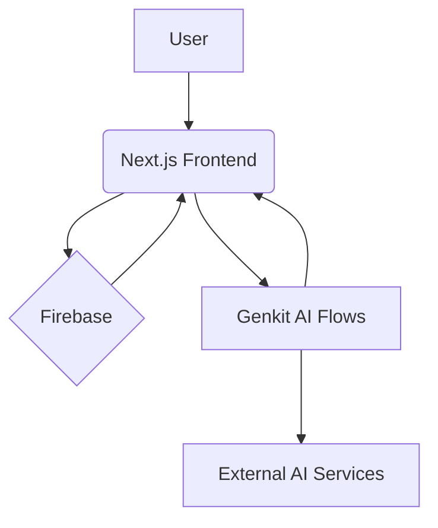

# Aran API Sentinel

Aran API Sentinel is a comprehensive platform for API security, governance, cataloging, and discovery. It is designed to provide organizations with full visibility and control over their entire API ecosystem, from legacy systems to modern microservices.

Leveraging AI-powered insights for automated API discovery and intelligent threat detection, Aran helps streamline API management, enforce consistent security policies, and foster better collaboration across development teams. Whether you are looking to secure your rapidly growing API landscape, ensure compliance, or simply understand your API inventory, Aran provides the tools you need.

This Next.js application serves as the primary interface to the Aran platform, integrating with Firebase for backend services and Genkit for its advanced AI capabilities.

## 🚀 Running the Frontend

To run the frontend development server, follow these steps:

1.  **Install dependencies**: This command installs all the necessary packages for the frontend application.
    ```bash
    npm install
    ```
2.  **Start the Next.js development server**: This command starts the development server, usually on `http://localhost:3000`.
    ```bash
    npm run dev
    ```
    The Next.js development server supports hot reloading, so changes you make to the code will be reflected in your browser automatically.

## 🧠 Running the Backend (AI Flows)

Genkit flows are used to define and run the backend AI logic.

To run the Genkit AI flows for development:
This command starts the Genkit development environment, allowing you to test and run your AI flows locally. You can usually access the Genkit developer UI at `http://localhost:4000` to inspect flows and their execution.
```bash
npm run genkit:dev
```

For running with auto-reloading when file changes are detected:
This command provides a convenient way to develop, as Genkit will automatically restart when you modify your flow definitions.
```bash
npm run genkit:watch
```

## 🏗️ System Architecture

The Aran platform comprises several key components working together:



*   **User**: Interacts with the Aran platform through the web interface.
*   **Next.js Frontend**: The primary user interface built with Next.js and React. It provides dashboards, API catalogs, policy management interfaces, documentation views, and administrative controls.
*   **Firebase**: Serves as a crucial part of the backend, providing services such as:
    *   User authentication and authorization.
    *   Firestore: A NoSQL database for storing application data, including API metadata, discovered document details, security policies, user information, and audit logs.
    *   Firebase Storage (Conceptual/Future): For storing uploaded API specification files or other large assets.
*   **Genkit AI Flows**: These are server-side TypeScript functions, orchestrated by Genkit, that power the AI-driven features of the application. This includes:
    *   Automated API discovery by analyzing traffic patterns or code.
    *   Intelligent threat detection by monitoring API request patterns and identifying anomalies.
    *   Other AI-assisted governance or cataloging tasks.
*   **External AI Services**: Genkit AI flows may connect to powerful external AI models (e.g., Google's Gemini models via Vertex AI, or other LLMs) to provide their advanced analytical and generative capabilities.

## 📄 Documentation

Comprehensive documentation for Aran API Sentinel is available on our Docusaurus-powered site, located in the `docs/website` directory. This site includes:

*   **Product Information**: An overview of Aran API Sentinel, its architecture, and core value propositions.
*   **Feature Guides**: Detailed explanations of all major features. Explore guides on:
    *   AI-Powered API Discovery
    *   Configuring Threat Detection parameters
    *   Setting up Security Policies
    *   Managing Access Control (RBAC)
    *   Understanding the MCP Catalog
    *   And more...
*   **Technical Documentation**: Setup information, workflow diagrams, and future API references.

**Accessing the Documentation:**

*   **Live Site (Once Deployed)**: The live documentation will be available at `https://YOUR_GITHUB_USERNAME.github.io/YOUR_REPOSITORY_NAME/` (Please update this URL after the first deployment via GitHub Pages, ensuring the path reflects your GitHub Pages configuration, e.g., it might include the Docusaurus site's `baseUrl` if not deploying to a root).
*   **Local Development**:
    1.  Navigate to the `docs/website` directory in your terminal:
        ```bash
        cd docs/website
        ```
    2.  Install dependencies (if you haven't already):
        ```bash
        npm install
        ```
        (or `yarn install` if you prefer Yarn)
    3.  Start the Docusaurus development server:
        ```bash
        npm run start
        ```
        (or `yarn start`)
    4.  Open the site in your browser, typically at `http://localhost:3000`.

We encourage you to explore the documentation site for a complete understanding of Aran API Sentinel.
