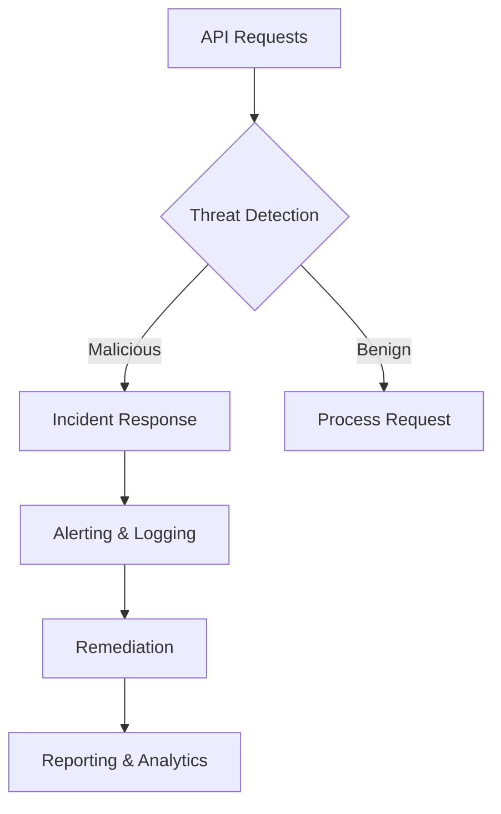
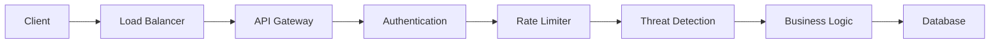

# Aran API Sentinel

## Enterprise-Grade API Security & Governance Platform



## Table of Contents
- [Key Features](#key-features)
- [Technology Stack](#technology-stack)
- [Quick Start](#quick-start)
- [Architecture](#architecture)
- [Configuration](#configuration)
- [Development](#development)
- [License](#license)

## Key Features

### Security Features
| Feature | Description | Status |
|---------|-------------|--------|
| Multi-Tenant Security | Complete data isolation between organizations | ✅ Production |
| API Discovery | Automated API cataloging and monitoring | ✅ Production |
| Threat Detection | Real-time security analysis | ✅ Production |
| MCP Security | Model Context Protocol monitoring | ✅ Production |
| Compliance | Built-in reporting and auditing | ✅ Production |

### AI Integration
| Provider | Type | Use Case |
|----------|------|----------|
| Ollama | Local | Privacy-sensitive analysis |
| OpenAI | Cloud | Complex analysis with GPT-4 |
| Gemini | Cloud | API insights and patterns |
| Rule-based | Fallback | Core detection logic |

## Technology Stack

### Frontend
| Technology | Purpose |
|------------|---------|
| Next.js 15 | React framework with App Router |
| React 18 | UI components and hooks |
| Tailwind CSS | Utility-first styling |
| Radix UI | Accessible component primitives |

### Backend
| Technology | Purpose |
|------------|---------|
| PocketBase | Real-time backend with auth |
| SQLite | Local database for metadata |
| Bun | JavaScript runtime and package manager |

## Quick Start

### Prerequisites
- [Bun](https://bun.sh/) (>=1.0.0)
- [Git](https://git-scm.com/)
- [Podman](https://podman.io/) (optional)

### Local Development

```bash
# Clone the repository
git clone https://github.com/radhi1991/aran.git
cd aran

# Install dependencies
bun install

# Run setup (downloads PocketBase, creates collections, seeds data)
bun run setup

# Start development server
bun run dev
```

### Access URLs
- **Frontend**: http://localhost:9002
- **PocketBase Admin**: http://127.0.0.1:8090/_/
- **Documentation**: https://radhi1991.github.io/aran/

## Architecture

### Multi-Tenant Design


### Security Features
1. **Authentication**
   - JWT-based authentication
   - Role-based access control
   - Session management

2. **API Protection**
   - Rate limiting
   - Request validation
   - Data sanitization

## Configuration

### Environment Variables
```bash
# Core
NODE_ENV=development
PORT=3000

# Database
DATABASE_URL=file:./dev.db

# Authentication
NEXTAUTH_SECRET=your-secret-key
NEXTAUTH_URL=http://localhost:3000

# Email (for notifications)
SMTP_HOST=smtp.example.com
SMTP_PORT=587
SMTP_USER=user@example.com
SMTP_PASSWORD=your-password
```

## Development

### Available Scripts
| Command | Description |
|---------|-------------|
| `bun run dev` | Start development server |
| `bun run build` | Build for production |
| `bun run start` | Start production server |
| `bun run lint` | Run linter |
| `bun run format` | Format code |
| `bun run test` | Run tests |

## License

This project is licensed under the MIT License - see the [LICENSE](LICENSE) file for details.

---

<div align="center">
  <p>Aran API Sentinel - Enterprise API Security Platform</p>
  <p> 2025 Aran Security. All rights reserved.</p>
</div>
