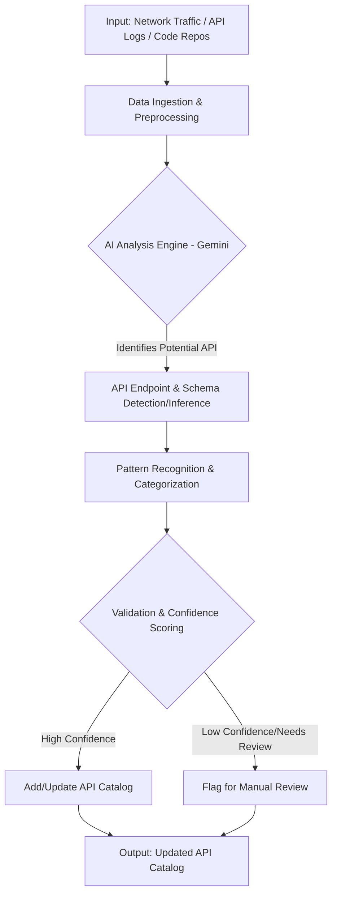
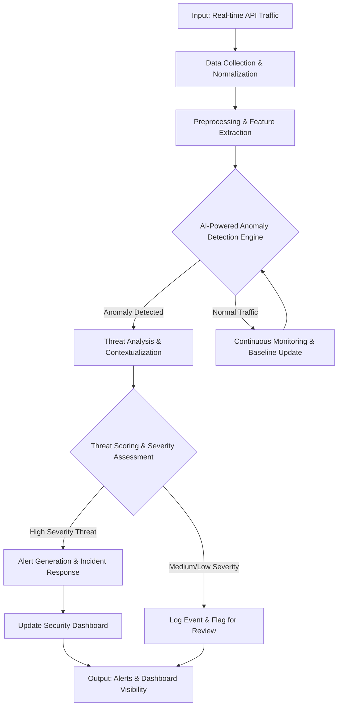

# Features Overview

Aran API Sentinel offers a holistic suite of integrated features designed to provide comprehensive visibility, security, and governance for your entire API ecosystem. Below is an overview of the core capabilities:

## API Catalog

The **API Catalog** serves as a centralized, searchable, and auto-updating repository of all your APIs. It provides a single source of truth, detailing API endpoints, specifications (e.g., OpenAPI/Swagger), versions, data classifications, and associated metadata.
*Why it's important:* Understanding what APIs you have, where they are, what data they handle, and who owns them is the first step towards effective security and governance. It helps eliminate shadow APIs and reduces the complexity of managing your API landscape.

## AI-Powered API Discovery

**AI-Powered API Discovery** automatically identifies and categorizes all APIs across your environment, including internal, external, and third-party services. By analyzing network traffic, code repositories, and other sources, it uncovers even undocumented or "shadow" APIs.
*How it helps:* Provides complete visibility into your actual API footprint, ensuring that all APIs are known, monitored, and can be brought under governance. This is crucial for understanding your true attack surface.

## AI-Powered Threat Detection (API Threats)

This feature **proactively identifies and alerts on potential security threats** targeting your APIs. Using machine learning, it analyzes API traffic for anomalous behavior, known attack patterns (like OWASP API Top 10), and business logic abuse.
*Its benefits:* Moves beyond signature-based detection to find novel and sophisticated attacks. It helps in early detection of breaches, reduces false positives, and enables faster incident response.

## MCP Catalog (Mission Critical Process Catalog)

The **MCP Catalog** allows you to define, manage, and gain visibility into your Mission Critical Processes and the APIs that underpin them. This links technical API assets to their business context and impact.
*What it is:* Provides a clear understanding of which APIs support critical business functions, helping prioritize security efforts and assess business risk associated with API vulnerabilities.

## Security Policies

Aran API Sentinel enables you to **define, enforce, and monitor consistent security policies** across your APIs. This includes policies for authentication, authorization, data encryption, rate limiting, input validation, and more.
*Purpose:* Standardizes security practices, helps automate compliance with regulations (e.g., GDPR, HIPAA, PCI DSS), and ensures a baseline level of security is applied universally.

## Access Control

**Access Control** features allow you to granularly control who can access which APIs and platform management functions. This includes role-based access control (RBAC) and integration with existing identity providers (IdPs).
*Importance:* Enforces the principle of least privilege, preventing unauthorized access to sensitive data and functionalities, and provides an auditable trail of user permissions and activities.

This overview provides a starting point for understanding Aran API Sentinel's capabilities. Each of these features will be explored in more detail in subsequent documentation sections.

### Note on API Document Inventory Backend

The API Document Inventory functionality, which allows for uploading and managing API specification files (detailed further in its dedicated documentation page), currently utilizes a local SQLite database for storing metadata and the server's local filesystem for the spec files themselves. This ensures data locality and self-contained operation for this specific feature.

## AI-Powered API Discovery Workflow

The following diagram illustrates the high-level workflow for AI-Powered API Discovery:

## AI-Powered Threat Detection Workflow

The following diagram illustrates the high-level workflow for AI-Powered Threat Detection:

