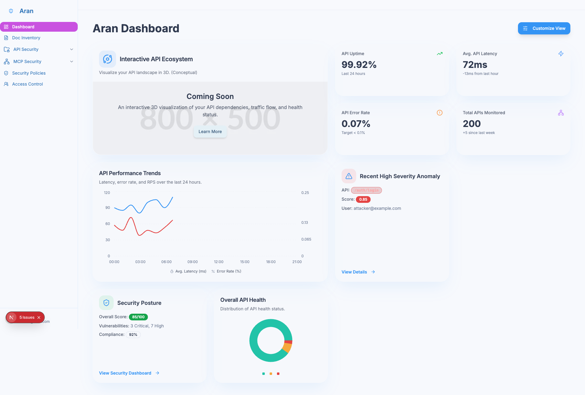
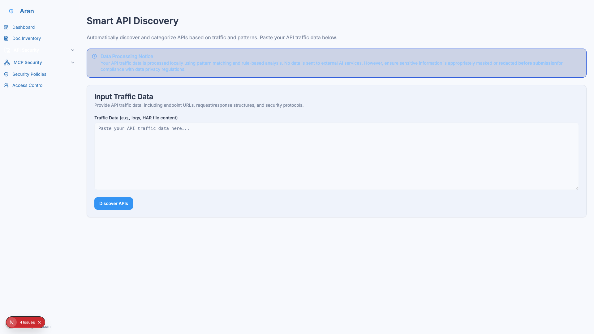
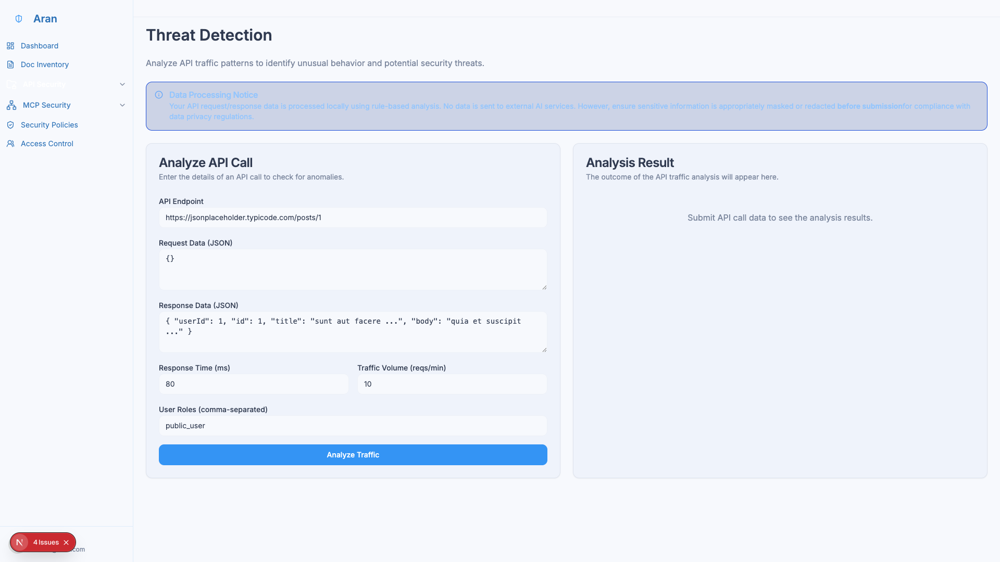
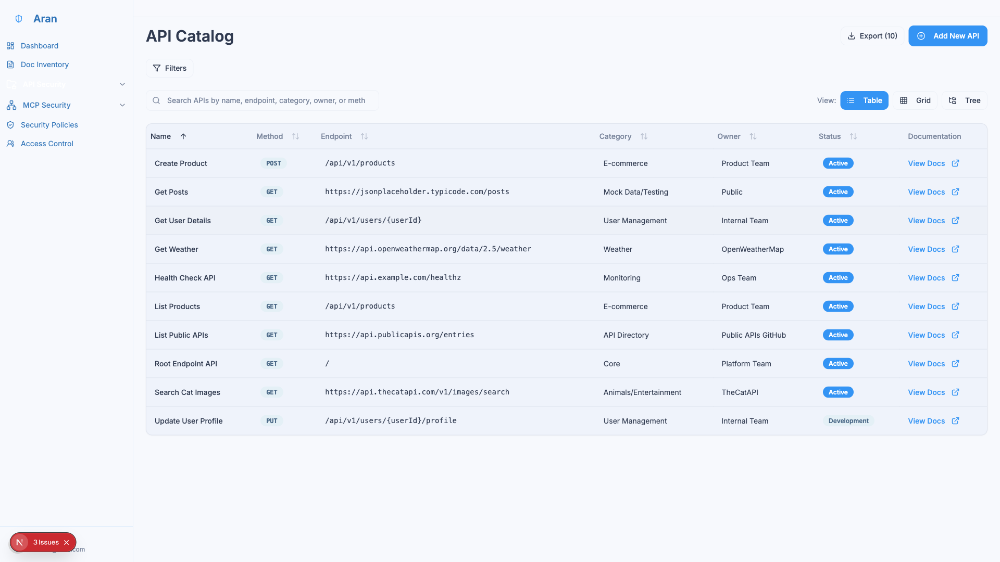
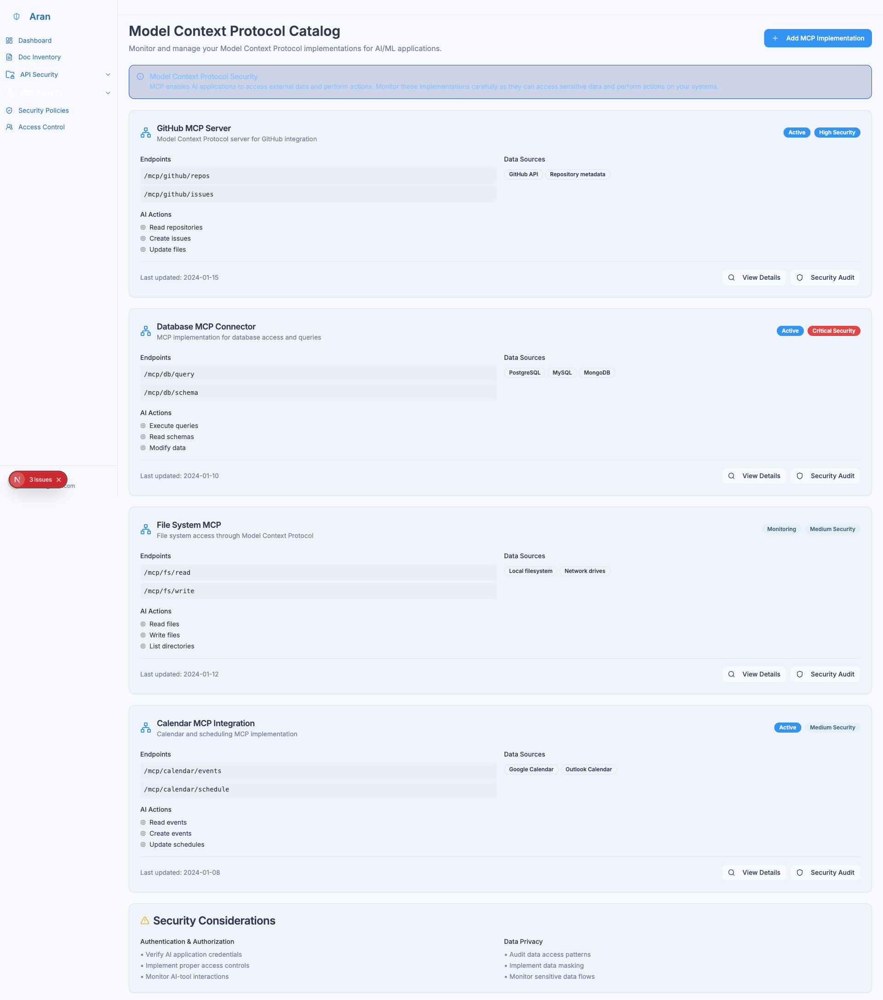
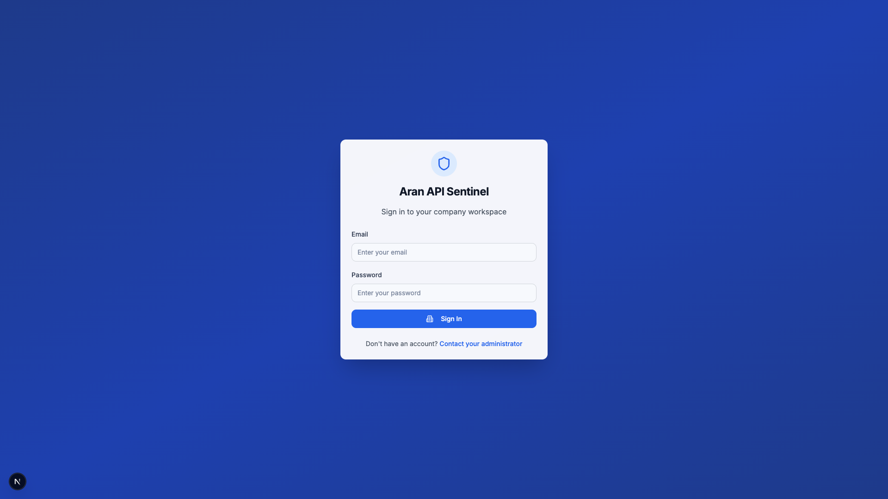

# Welcome to Aran API Sentinel

Aran API Sentinel is a comprehensive platform designed for API security, governance, cataloging, and discovery. It empowers organizations to take control of their API landscape through rule-based insights, centralized management capabilities, and proactive security measures.



## 🚀 **Multi-Tenant Architecture**

Aran features a complete multi-tenant architecture powered by **PocketBase**, enabling organizations to:

- **🏢 Manage Multiple Companies**: Each company has isolated data and users
- **👥 Role-Based Access**: Admin, Manager, Analyst, Viewer roles per company
- **🔐 Secure Authentication**: Built-in multi-tenant authentication
- **📊 Real-time Updates**: Live data synchronization across all clients
- **📝 Audit Logging**: Comprehensive activity tracking per company

## 🎯 **What Aran Does**

Aran API Sentinel provides a complete solution for API lifecycle management:

- **🔍 Discover** all your APIs—internal, external, shadow, and zombie—providing a complete, real-time inventory
- **📚 Catalog** and organize your APIs with rich metadata and documentation
- **🛡️ Secure** your APIs with comprehensive threat detection and security policies
- **📊 Monitor** API health, performance, and security posture in real-time
- **🤖 Monitor** Model Context Protocol (MCP) implementations for AI/ML security
- **📋 Govern** APIs with consistent policies and compliance standards

## 🖼️ **Key Features in Action**

### **📊 Dashboard & Analytics**

*Comprehensive dashboard with API health metrics, security posture, and real-time monitoring*

### **🔍 API Discovery**

*Automated API discovery using pattern matching and rule-based analysis*

### **🛡️ Threat Detection**

*Real-time threat detection with rule-based analysis and anomaly scoring*

### **📚 API Catalog**

*Centralized API catalog with search, filtering, and governance features*

### **🤖 MCP Security**

*Model Context Protocol security monitoring for AI/ML applications*

### **🔐 Multi-Tenant Login**

*Secure multi-tenant authentication with company-specific access*

## 🏗️ **Technical Architecture**

### **Frontend (Next.js 15)**
- **React 18**: Modern UI components with hooks
- **Tailwind CSS**: Utility-first styling with custom design system
- **Radix UI**: Accessible component primitives
- **TypeScript**: Full type safety throughout

### **Backend (PocketBase)**
- **Real-time Database**: SQLite with real-time updates
- **Built-in Auth**: Multi-tenant authentication
- **Admin Panel**: Visual data management
- **REST API**: Automatic REST endpoints
- **File Storage**: Secure file handling

### **Multi-Tenant Features**
- **Tenant Isolation**: Complete data separation per company
- **Role-Based Access**: Granular permissions per user
- **Audit Logging**: Comprehensive activity tracking
- **Real-time Updates**: Live data synchronization

## 🚀 **Quick Start**

### **1. Install Dependencies**
```bash
npm install
```

### **2. Start Development Servers**
```bash
npm run dev:full
```

This starts:
- **PocketBase**: `http://127.0.0.1:8090` (Backend)
- **Next.js**: `http://localhost:9002` (Frontend)

### **3. Access the Application**
- **Main App**: `http://localhost:9002`
- **Admin Panel**: `http://127.0.0.1:8090/_/`
- **Login**: `http://localhost:9002/login`

## 📈 **Use Cases**

### **✅ For SaaS Providers**
- **Multi-tenant Architecture**: Easy to add new companies
- **Data Isolation**: Complete separation between tenants
- **Custom Branding**: Company-specific logos and settings
- **Usage Analytics**: Per-company usage tracking

### **✅ For Enterprise**
- **Department Isolation**: Separate workspaces per department
- **Role-Based Security**: Granular permissions per user
- **Audit Compliance**: Complete activity logging
- **Custom Policies**: Company-specific security rules

### **✅ For Developers**
- **Real-time Updates**: Live data synchronization
- **Admin Panel**: Easy data management interface
- **API-First**: RESTful API for all operations
- **Type Safety**: Full TypeScript support

## 🔐 **Security Features**

- **Tenant Isolation**: Complete data separation
- **Role-Based Access**: Granular permissions
- **Audit Logging**: Comprehensive activity tracking
- **Real-time Security**: Live threat detection
- **API Rate Limiting**: Per-company usage limits
- **Secure File Storage**: Encrypted file handling

## 📚 **Documentation Sections**

Explore our comprehensive documentation:

- **[Getting Started](./getting-started/installation.md)**: Setup and installation guide
- **[Features](./features/feature-overview.md)**: Detailed feature documentation
- **[Multi-Tenant Setup](./multi-tenant-setup.md)**: Multi-tenant configuration
- **[API Reference](./api-reference.md)**: Technical API documentation
- **[Security Guide](./security-guide.md)**: Best practices and compliance

## 🤝 **Contributing**

We welcome contributions! Please see our [Contributing Guide](../../../CONTRIBUTING.md) for details.

---

**Aran API Sentinel** - Your complete multi-tenant API security and governance platform! 🚀
